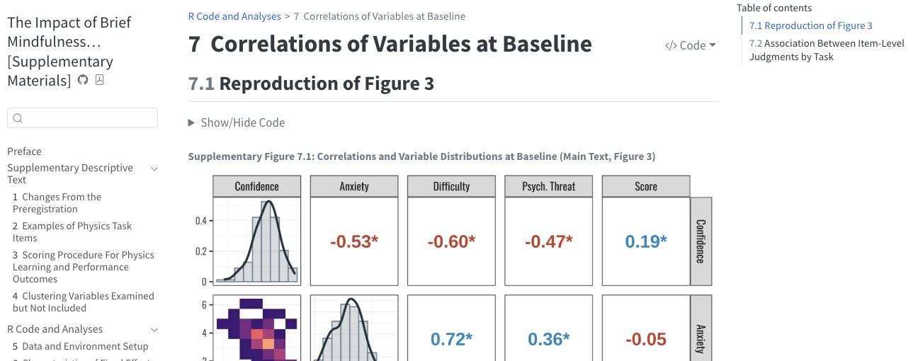

[{.drop-shadow fig-alt="Featured image"}](https://apelakh.github.io/pelakh-et-al-2025-supplement/)

[Check out a live version of the book here!](https://apelakh.github.io/pelakh-et-al-2025-supplement/) or view the source code on [GitHub ](https://github.com/apelakh/pelakh-et-al-2025-supplement)

You can also access a preprint of the manuscript on PsyArxiv: <https://doi.org/10.31234/osf.io/sqpd5_v1>