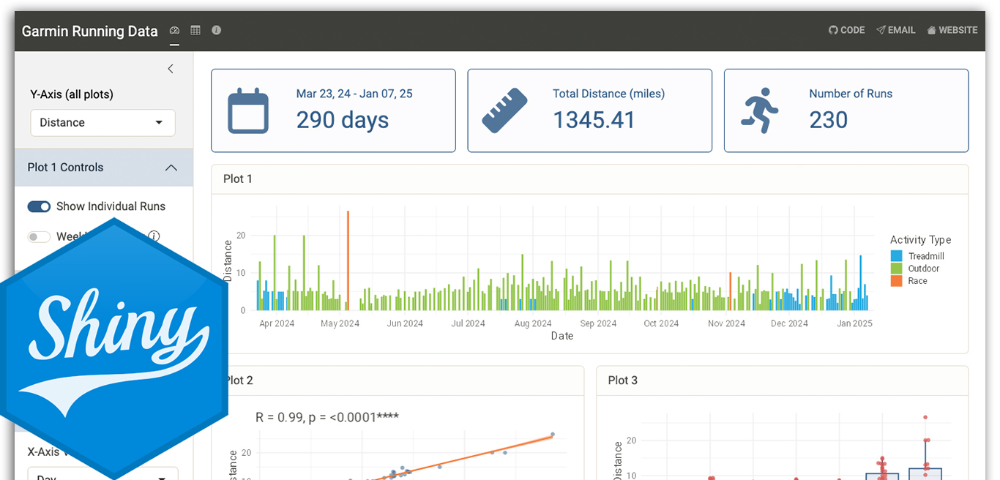

[{fig-alt="Featured image"}](https://avitalpelakh.shinyapps.io/garmin_activities/)

[Check out a live version of the app here!](https://avitalpelakh.shinyapps.io/garmin_activities/)

This Shiny app was inspired by the [Tidy Tuesday](https://github.com/rfordatascience/tidytuesday "Tidy Tuesday GitHub Repo") prompt for January 7, 2025. All layouts and theming were created with the help of [`bslib`](https://rstudio.github.io/bslib/index.html).

The data are my personal running activities downloaded from Garmin Connect. Feel free to check out the [source code](https://github.com/apelakh/garmin_shiny_app) and [send me any feedback, questions, or suggestions](mailto:apelakh@gmail.com). I may continue to update the app as I have time!
