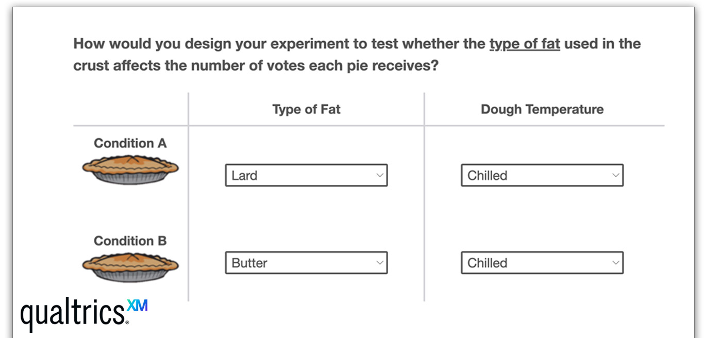

[{fig-alt="Screen shot from lesson"}](https://pitt.co1.qualtrics.com/jfe/form/SV_9nT6VtuBHKVWuYm?source=personal_website)

### About

This interactive lesson was designed as part of a self-directed final project for E-Learning Design Principles and Methods, a graduate-level course taken during Fall 2023 at Carnegie Melon University with Dr. Ken Koedinger.

The activity was designed using the Qualtrics survey platform using custom-written HTML, CSS, and JavaScript. [Click here](https://pitt.co1.qualtrics.com/jfe/form/SV_9nT6VtuBHKVWuYm?source=personal_website) to preview the lesson and provide some feedback!
