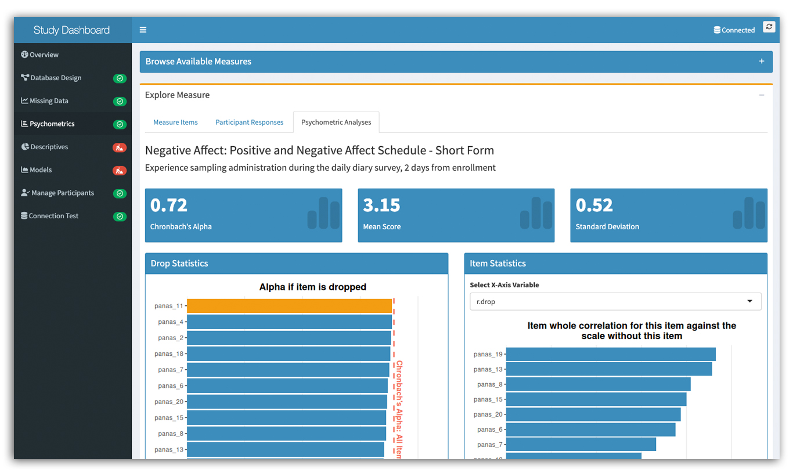

[{fig-alt="Featured image"}](https://github.com/apelakh/longitudinal_research_dashboard)

[Run the app on a local machine using Docker](https://github.com/apelakh/longitudinal_research_dashboard)

This app was built as part of a database management course. It is a Shiny application for analyzing longitudinal survey data with database integration. The database schema showcases an organizational framework for storing complex research data (simulated for demonstration purposes). The application provides tools for exploring psychometric properties, visualizing missing data patterns, and managing participant enrollment.

Follow the instructions in the [GitHub repository](https://github.com/apelakh/longitudinal_research_dashboard) to download the files and run the app on your local machine using Docker. There are two containers - one for the database and one for the app. Please reach out with any comments or questions!
